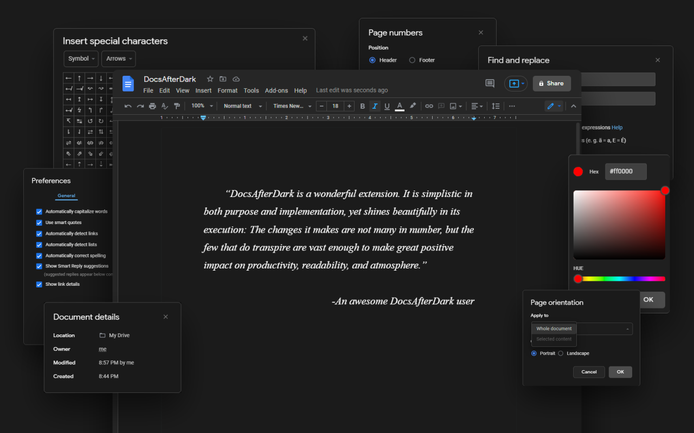
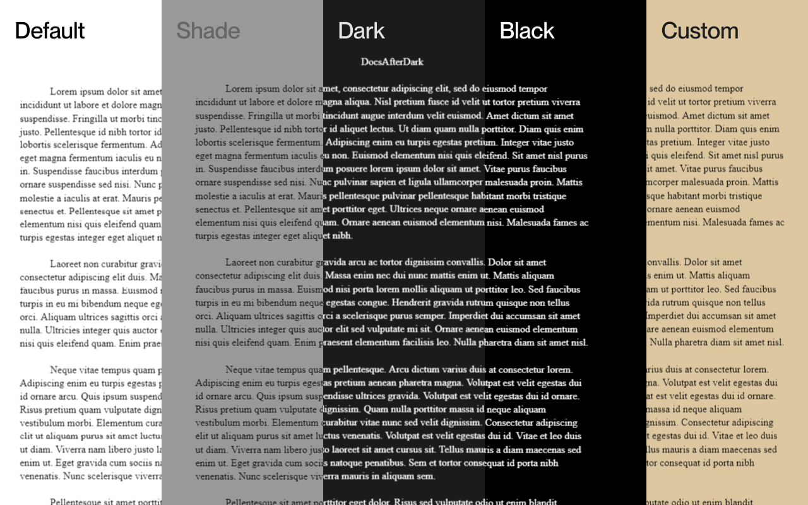
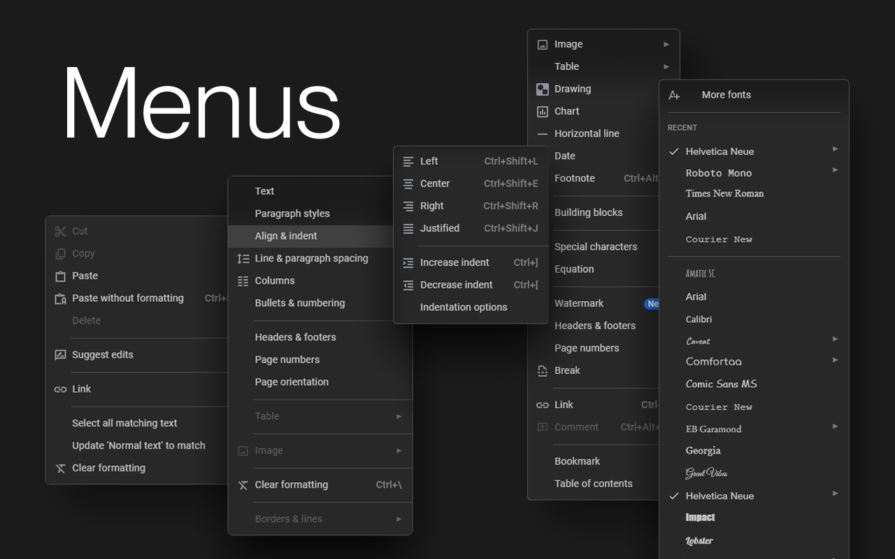
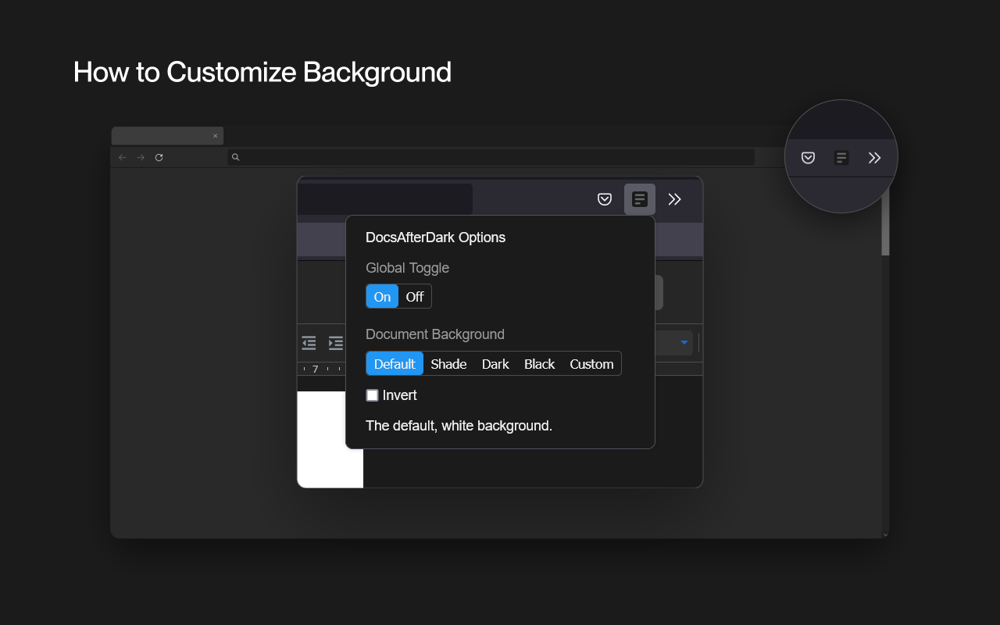

# DocsAfterDark

 

DocsAfterDark relieves eye-strain from the Google Docs experience with a focus on functionality and artful design.

Easily enable or disable dark mode for any document without modifying the original project. Access dark mode settings and more in the extension option menu, which can be accessed by clicking on the extension icon in the browser toolbar.

Customize the document background to a darker shade, or use any valid background CSS value in the custom field, including images, gradients, and transparent backgrounds.\*

With the invert and grayscale options, document content (excluding images\*) will be rendered in a comfortable dark mode. By disabling the document border option, documents can blend with the background to create a seamless workspace.

To temporarily toggle dark mode on/off, click on the button in the bottom left corner of the page. Sometimes this button may block other elements, such as the word count widget. When this occurs, enable the Raise Button toggle in the option menu.

The global toggle in the option menu can be used to disable/enable the extension.

\*Only on Firefox

Available on [Firefox Add-Ons](https://addons.mozilla.org/en-US/firefox/addon/docsafterdark/), [Chrome Web Store](https://chrome.google.com/webstore/detail/docsafterdark/pihphjfnfjmdbhakhjifipfdgbpenobg), [Edge Add-Ons](https://microsoftedge.microsoft.com/addons/detail/docsafterdark/bbpgjhhjjphjmabmohnkkpmelbfpgfna), and [Opera](https://addons.opera.com/en/extensions/details/docsafterdark/).

---

---

## Extension Stats

### Firefox

  

### Chrome

  
